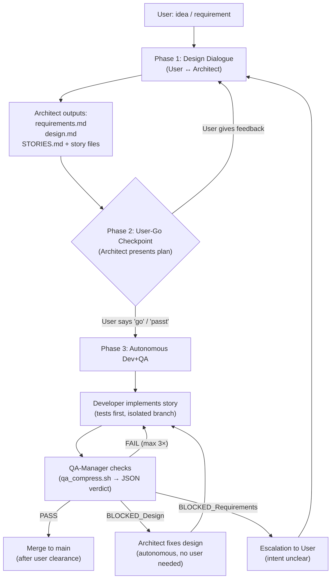

# opencode Pipeline

Multi-agent development pipeline for folder projects: **Requirements → Design → Stories → Dev (cheap model) → QA Gate**. Everything kept as flat, portable opencode config (config-as-code).

> **Heads-up:** This repository intentionally contains **no `opencode.jsonc`** (provider endpoints, model selection) and **no `cron.db`** (local state). Both stay **local** per machine and are gitignored here.

> **Per-agent model assignment:** The roles (`agent/*.md`) no longer carry a hardcoded `model:` line. Which model runs for which purpose is configured **locally in the JSON** under `agent` (see § "Model assignment in the JSON"). Other machines have different providers/model names → only adjust the local JSON, the role files stay untouched.

---

## What's inside — and why

| Folder | Contents | Why |
|---|---|---|
| `agent/` | `architect`, `developer`, `qa-manager`, `documenter` | The four pipeline roles as opencode agents |
| `templates/` | `AGENTS.md`, `.gitignore` | Skeletons for new projects (AGENTS.md + gitignore) |
| `scripts/` | 15 deterministic Python scripts + `qa_compress.sh` | Pipeline automation: worktree setup, story management, QA routing, session recovery, feature claiming, project scaffolding, architecture checks |
| `command/` | `qa_summary`, `qa-check`, `status`, `new-project`, `requirements`, `decompose`, `implement`, `document` | Invokable commands that orchestrate the flow |
| `docs/features/` | Feature → Story hierarchy | Hierarchical planning structure (features contain stories) |
| `.pipeline/` | `intent.json`, `qa-state/` | Persistent pipeline state (intent tracking, QA verdicts) |

The goal is a **lean, cheap, autonomously running multi-agent system** — no nested LLM cascades that burn tokens.

---

## Design decisions behind it (the "why")

### 1. Separation of functions: Architect thinks, Developer writes, QA checks, Documenter reconciles

- **architect** (strong) — talks Requirements/Design/Stories out in dialogue. Pure reasoning.
- **developer** (cheap bulk model) — implements **exactly one story** isolated per branch. Many in parallel.
- **qa-manager** (cheap model) — **deterministic judge**, not a thinker. Strong model only as **fallback** via `architect` for unclear error/design causes.
- **documenter** (cheap model) — reconciles documentation after QA-PASS: README, design docs, docstrings, stale comments. Does not invent — synthesizes what exists.

### 2. The three efficiency levers (core of the "why")

1. **Streamline & offload QA** — cost dampener
   - pytest logs are **deterministically compressed** (`qa_compress.sh`, ≤200 tokens instead of 20 000 log spam). **Evaluating pytest does not need a big model.**
   - QA output is **strictly JSON-only** (`status | reason | failed_tests`), no monologues, no style chit-chat.
   - Cheap model for the QA judge; the expensive model only for unclear causes.

2. **Break the cascade** — against context bloat
   - `BLOCKED_Design` → **stays autonomous**: QA delegates root-cause analysis to `architect` with a lean diagnosis (2 sentences + compressed test list, **no log spam**).
   - `BLOCKED_Requirements` → **escalate to the user** (only the user knows the intent).
   - No automatic architect-dispatch from QA. Results are **passed through 1:1**, nothing reformulated.

3. **Autonomy with hard limits**
   - The process runs a long time **without user interaction** (dev waves, QA, design repair).
   - **Autonomy budget:** max. 3 developer FAIL loops + max. 1–2 architect design fixes per story. If both run dry → **BLOCKED_Requirements to user** (no endless looping).
   - **Phase-0 checkpoint:** before every dev/QA start the architect presents the plan; only **explicit user-go** starts the machine — except for purely technical design corrections.

### 3. Architecture of the projects this pipeline builds (from the workflow)

The actual pattern behind everything is **function vs. connectivity**:

- `src/core/` — pure logic/rules, **zero imports** from framework/IO/DB/API. Gets everything as parameters, returns dicts/primitives. Fully unit-testable.
- `src/adapters/` — **thin wrappers** (3–10 lines): read/write external interfaces, delegate decisions to core.
- **Fake interfaces are mandatory** for every external dependency → tests run without real systems.

Therefore: **tests exist BEFORE the code**, each story has its own fake-based test criteria.

### 4. Why config-as-code / Git

- The whole pipeline is only **flat, readable files** (Markdown + a portable bash script). No secrets, no binary format.
- Thus **transferable to other machines / other opencode installs**: clone, done. The exec bit of `qa_compress.sh` is preserved via Git.
- **No secrets** in the config → safe to commit.
- The only machine-specific part (`opencode.jsonc`) stays deliberately local.

---

## Installation on another machine

```bash
# 1. Clone the repo (release branch = stable, default)
#    (if ~/.config/opencode already exists: back it up / empty it first)
git clone git@github.com:bachmarc/opencode-pipeline.git ~/.config/opencode

# The default branch is 'release' (stable). If you want to contribute
# to development, switch to main:
#   git checkout main
```

Then restart `opencode` — agents, skills, commands are active.

### Local configuration (stays per machine)

Create `~/.config/opencode/opencode.jsonc` (e.g.):

```jsonc
{
  "$schema": "https://opencode.ai",
  "provider": { /* your model provider, e.g. Ollama via openai-compatible */ },
  "model": "provider/model",            // primary/dialogue model
  "small_model": "provider/model",      // lean model (titles, summaries)
  "agent": {                            // model per agent (architect/developer/qa-manager/documenter)
    "architect": {
      "model": "provider/strong",
      "permission": { "task": { "developer": "ask", "qa-manager": "ask" } }
    },
    "developer":   { "model": "provider/cheap"   },
    "qa-manager":  { "model": "provider/cheap"   },
    "documenter":  { "model": "provider/cheap"   }
  },
  "skills": { "paths": ["~/.config/opencode/skills"] }
}
```

> **Do not** commit this here — it's in `.gitignore`, because host/provider differ per machine.

### How model assignment works ("the JSON procedure")

The four role files (`agent/architect.md`, `developer.md`, `qa-manager.md`, `documenter.md`) no longer set a model (previously hardcoded as `model:`). Instead there's a **separation: role vs. machine**:

- **Role (portable, in Git):** *who does what* — mode, temperature, prompt, rules. In `agent/*.md`.
- **Machine (local, gitignored):** *which model* for *what*. In `~/.config/opencode/opencode.jsonc` under `agent`.

**Why:**
- Other machines have different APIs/providers wired up and different model names. When the model was hardcoded in the role file, the role core had to be touched.
- Now a **single local file** (`opencode.jsonc`) suffices — provider endpoints, model names **and** the `agent` assignment. On a clone on a new machine you only create/adjust this file; the roles stay identical.

**Concrete procedure per machine:**
1. `git clone git@github.com:bachmarc/opencode-pipeline.git ~/.config/opencode`
2. Create `opencode.jsonc` (see above) with your provider + the `agent` mapping entries matching your available models.
3. Restart `opencode` — the config is loaded at startup; changes are not hot-reloaded.
4. If a mapping entry is missing, opencode does not fail: an agent without an assigned model falls back to the global `model` as default.

### Enforcing the Phase-0 checkpoint technically (not just via prompt)

The rule "no dev/QA without explicit user-go" lives in the prompts — but an LLM follows instructions probabilistically and can "overhear" them. The fix: opencode's `permission.task` system. When the architect tries to spawn a developer or qa-manager, a **UI approval dialog pops up for you** — every time. Your "allow" click **is** the user-go, technically enforced. The architect cannot silently start the machine.

```jsonc
"agent": {
  "architect": {
    "permission": { "task": { "developer": "ask", "qa-manager": "ask" } }
  }
}
```

- The prompt rules stay as behavioral training, but the hard guarantee comes from the permission system.
- Internal QA loops (QA → developer on FAIL fixes) are intentionally **not** gated — that autonomy should remain, since the wave was already started by you.
- This block belongs in the local `opencode.jsonc` (it's config, not a role), so it travels with the model assignment on every machine.

---

## Deployment (dev repo → live config)

### Branching strategy

The repository uses a **two-branch deployment model**:

- **`main` branch** — development line. Stories are developed and merged here after the QA gate. May be unstable between milestones.
- **`release` branch** — stable, deployable state. Promoted from `main` only when the user considers the code production-ready. The live clone (`~/.config/opencode`) pulls from `release`, not `main`.

### Promotion workflow

When `main` is stable enough for production, promote it to `release` using the `promote_release.py` script:

```bash
python scripts/promote_release.py
```

This script:
1. Validates that `main` is clean and up-to-date with remote
2. Fast-forward merges `release` to current `main` HEAD
3. Pushes `release` to remote
4. Outputs JSON with promotion status and commit hashes
5. Returns exit code 0 on success, 1 on dirty state or if behind remote

### Live clone deployment

The **live clone** (`~/.config/opencode`) pulls from the `release` branch, not `main`:

```bash
git -C ~/.config/opencode pull origin release
```

Then **restart opencode** — the config is loaded once at startup, there is no hot-reload. Running sessions keep using the old config until they are restarted.

**What a pull does not touch:** `opencode.jsonc` and `cron.db` are gitignored, so a pull never overwrites them. New agent-/command-/skill-/template files appear automatically after pull + restart.

**Versioning:** `APP_VERSION` (in `APP_VERSION.py` at the repo root) — bump on notable merges, documented in STORIES.md.

**New config options:** if a release introduces new `opencode.jsonc` options (e.g. the `permission.task` block), **every machine** must add them to its local file once — see § "How model assignment works" above for the per-machine procedure.

**Rollback:** check out a known-good version in the live clone and restart opencode:

```bash
git -C ~/.config/opencode checkout <tag-or-hash>
```

**No deploy script — by design (D2):** deployment stays deliberately manual (staged rollout; the framework steers the running agent). Optional convenience later, manual is the default.

---

## Per-project AGENTS.md (project knowledge, per repo)

Every project repo carries its own `AGENTS.md` — loaded via `"instructions": ["AGENTS.md"]` as context into **every session of every agent** working in that folder. It is not the agents' definition (that lives here, in `agent/*.md`); it is the **project's knowledge**: stack, core rules, architecture separation, git conventions, references.

- **Agent definition (global, this repo):** who the agent is, prompt, behavior — identical on every machine.
- **Project AGENTS.md (per repo, in the project):** what the project is and which rules its code must follow — versioned with the code, correct on every checkout.

**Template:** `templates/AGENTS.md` provides the skeleton. Constant sections (workflow, git conventions, languages, prohibitions) are the binding interface between framework and project and stay untouched; project-specific placeholders (`name`, stack, core rules, references) are filled in dialogue. The architect must use the template — no improvising from zero.

---

## How the workflow works — step by step

This section explains the **practical "how"**: what you do as a user, what the agents do autonomously, and where the handoffs happen.

### Overview (Mermaid)



### Phase 1: Design dialogue (User ↔ Architect)

You start by talking to the **Architect** — either via `/new-project` (new repo) or `/requirements` (existing repo). The Architect conducts an **iterative interview**: it asks about the problem, target audience, scope boundaries, and non-functional requirements. You answer, it refines, you correct — this is a back-and-forth dialogue.

**How to stay in the dialogue:** The Architect runs in `mode: all` (direct conversation partner). You talk to it like a colleague. It will ask clarifying questions — answer them. If it tries to spawn a Developer or QA-Manager prematurely, the **`permission.task` system** pops up an approval dialog (Tab key to confirm/deny). This is your hard technical gate — the Architect cannot silently start the machine.

**What the Architect produces:**
- `docs/requirements.md` — functional + non-functional requirements with REQ-IDs
- `docs/design.md` — architecture (function vs connectivity, fake interfaces, data model)
- `STORIES.md` + `docs/stories/<phase>-<id>-<slug>.md` — decomposed, implementable stories with developer targets and test criteria

**Key principle:** Stories are cut small enough that a **cheap mass model** can implement each one in isolation on its own Git branch. No monster stories. The expensive/strong model (Architect) only reasons about design — it never writes code.

### Phase 2: User-Go checkpoint

Before any implementation starts, the Architect presents a **concrete implementation overview**:
- **WHAT:** which stories, which developer targets (exact scope — no more, no less)
- **HOW:** execution order (waves), which fakes are needed, test criteria per story

**You must give explicit approval** ("passt", "go", or similar). Without your go, nothing starts. If you have feedback, it flows back into planning (loop back to Phase 1), and the Architect presents a revised plan.

This checkpoint exists both as a **prompt rule** (behavioral) and as a **technical enforcement** via `permission.task` — even if the LLM "overhears" the prompt rule, the UI approval dialog catches it.

### Phase 3: Autonomous Dev+QA

Once you give the go, the pipeline runs **autonomously for a long time** without needing you:

1. **Developer** (cheap model) picks up a story, creates branch `feature/<story-id>-<slug>`, and works in its own Git worktree (`.worktrees/<story-id>-<slug>/`).
   - Reads the story's developer targets and test criteria
   - **Writes tests first** (using fake interfaces — no real external systems)
   - Implements exactly the developer targets in `src/core/` (pure logic) then `src/adapters/` (thin wrappers)
   - Runs `pytest` green, commits with metadata

2. **QA-Manager** (cheap model) checks the branch — **deterministically, not by thinking**:
   - Runs `qa_compress.sh` which compresses pytest output to ≤200 tokens (exit code + failed test names + assertions — no log spam)
   - Evaluates the compressed result against acceptance criteria
   - Checks architecture separation (no IO imports in core, fake parity, integration tests call real orchestration code)
   - Returns a **strict JSON verdict**: `{"status": "PASS|FAIL|BLOCKED_*", "reason": "...", "failed_tests": [...]}`

3. **On PASS** → branch is cleared for merge (you confirm the merge).

**Multiple stories can run in parallel** — each Developer works in its own worktree on its own branch. The QA-Manager checks each independently.

### Escalation paths (when things go wrong)

The pipeline has **hard autonomy limits** to prevent endless looping:

#### FAIL → Developer fix loop (max 3 rounds)

If QA returns FAIL, the Developer gets a **concrete fix assignment** (file, line, what's missing) and fixes on the same branch. QA checks again. This loops **at most 3 times** — if the story still fails after 3 rounds, it escalates to BLOCKED.

#### BLOCKED_Design → Architect repairs autonomously

If the failure is a **design gap** (test not simulatable, story wrongly cut, core/adapter separation undesigned), QA triggers the Architect with a lean 2-sentence diagnosis. The Architect fixes the design **minimally invasive** — no user needed for technical corrections. Then a new Dev round starts.

**Autonomy budget:** max 1–2 Architect design fixes per story. If the fix doesn't resolve it → escalation to user.

#### BLOCKED_Requirements → Back to you

If the failure is a **domain/intention question** (requirement unclear, behavior ambiguous, feature scope uncertain), QA escalates to you with a precise question. Only you know the intent — the pipeline never guesses.

### Quick reference (commands)

| Command | Agent | What it does |
|---|---|---|
| `/new-project` | Architect | Create new project + start requirements interview |
| `/requirements` | Architect | Start/continue requirements & design dialogue |
| `/decompose` | Architect | Break requirements into stories |
| `/implement <story-id>` | Developer | Implement one story (tests first, isolated branch) |
| `/qa-check <branch>` | QA-Manager | Run QA gate → JSON verdict (PASS/FAIL/BLOCKED) |
| `/status` | QA-Manager | Show implementation status (table: story, branch, tests, QA, error) |
| `/qa_summary` | — | Run `qa_compress.sh` and show compact test report |
| `/document [scope]` | Documenter | Reconcile documentation against code state |

---

## The four agents in detail

| | architect | developer | qa-manager | documenter |
|---|---|---|---|---|
| **Role** | Requirements-/Design-/Story partner, dialogue | Cheap story implementer | Deterministic gatekeeper | Documentation consistency |
| **Model** | strong | cheap bulk | cheap (+ strong fallback via architect) | cheap |
| **Model source** | `opencode.jsonc` → `agent.architect.model` | `opencode.jsonc` → `agent.developer.model` | `opencode.jsonc` → `agent.qa-manager.model` | `opencode.jsonc` → `agent.documenter.model` |
| **Mode** | `all` (dialogue) | `subagent` | `all` | `subagent` |
| **Output** | Docs / Stories | Branch + commit | JSON (`PASS/FAIL/BLOCKED_*`) | Updated docs + docstrings |
| **Budget** | — | 1 story = 1 branch | max. 3 FAIL loops, then escalation | after QA-PASS, before merge |

---

## Extending: new test processes (`qa_compress.sh` is modular)

`qa_compress.sh` uses a **checker-registry pattern**. Each test process (pytest, ruff, mypy, …) is a function that writes its compressed result to stdout and returns its subprocess's exit code.

```bash
# 1. Define a new checker function
mypy_check() { mypy "$@" >/dev/null 2>&1; return $?; }

# 2. Register (activate) it
register_check mypy mypy_check
```

Aggregation (overall FAIL as soon as one checker is non-zero) and exit code happen automatically. Future test processes = one function + one registration line.

---

## Open points / outlook

- `qa_compress.sh` is verified against **pytest 9** (PASS: `78 passed`; FAIL: `2 failed, 1 passed`); for older pytest versions check one line in the summary grep if needed.
- Optional: merge into a shared `~/dotfiles` repo with other tools (then via symlink instead of a direct clone).
